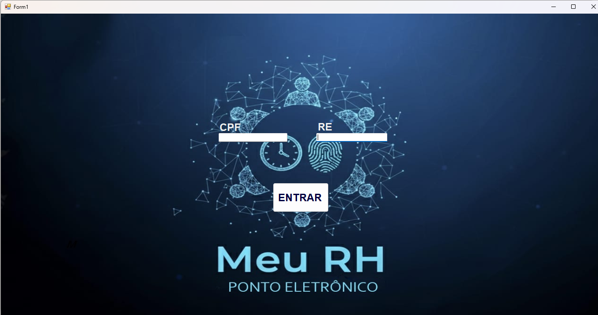
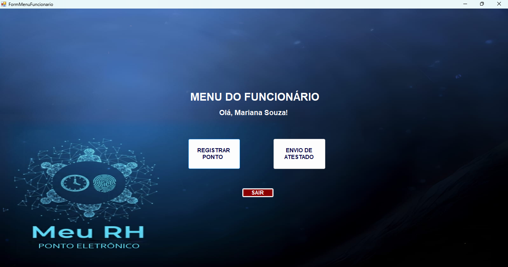
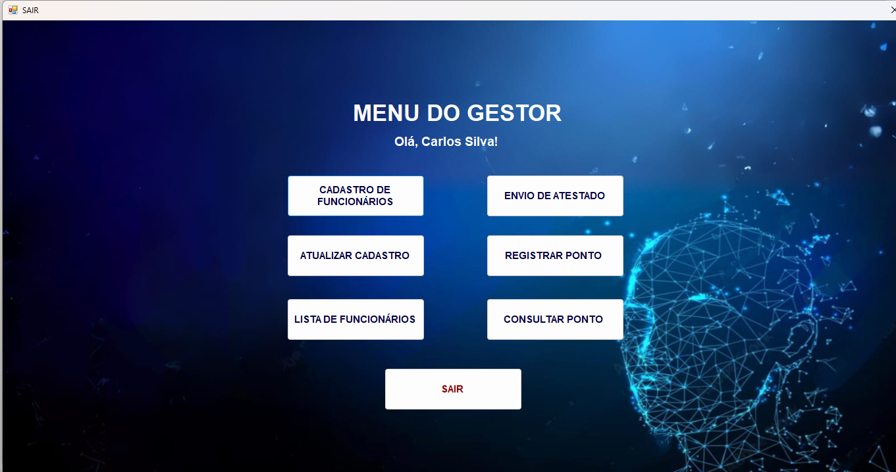
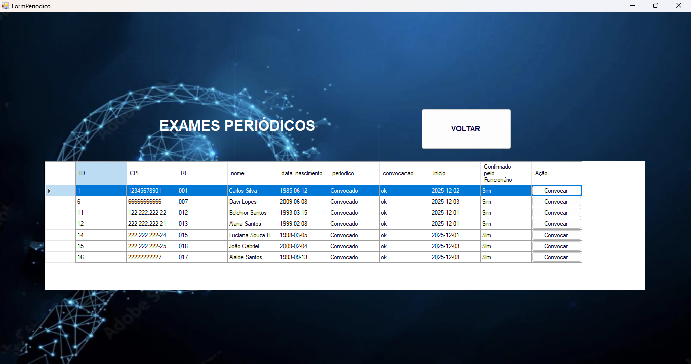
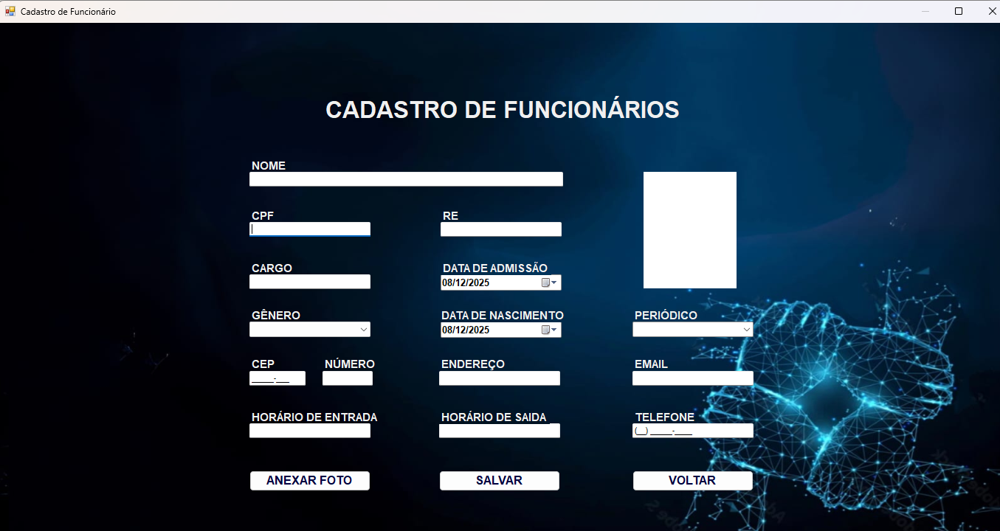
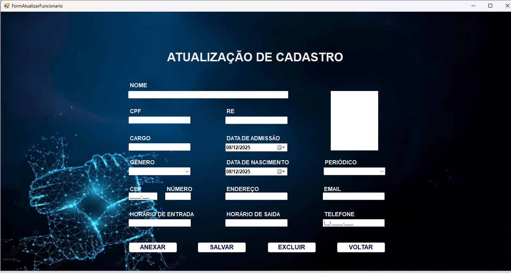
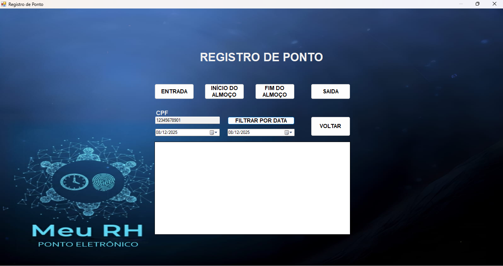
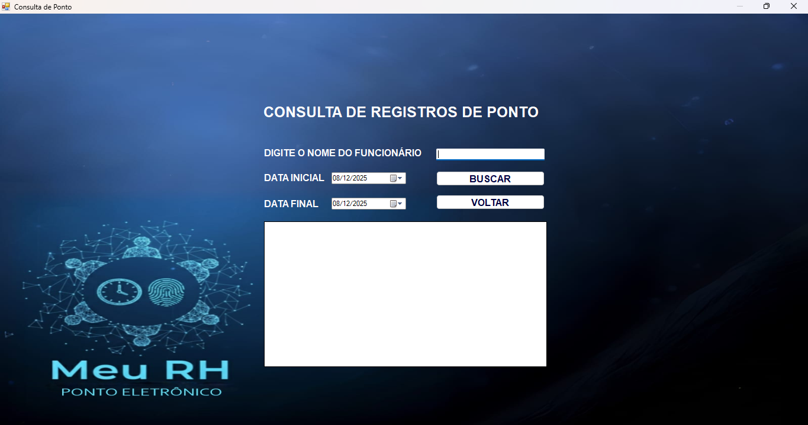
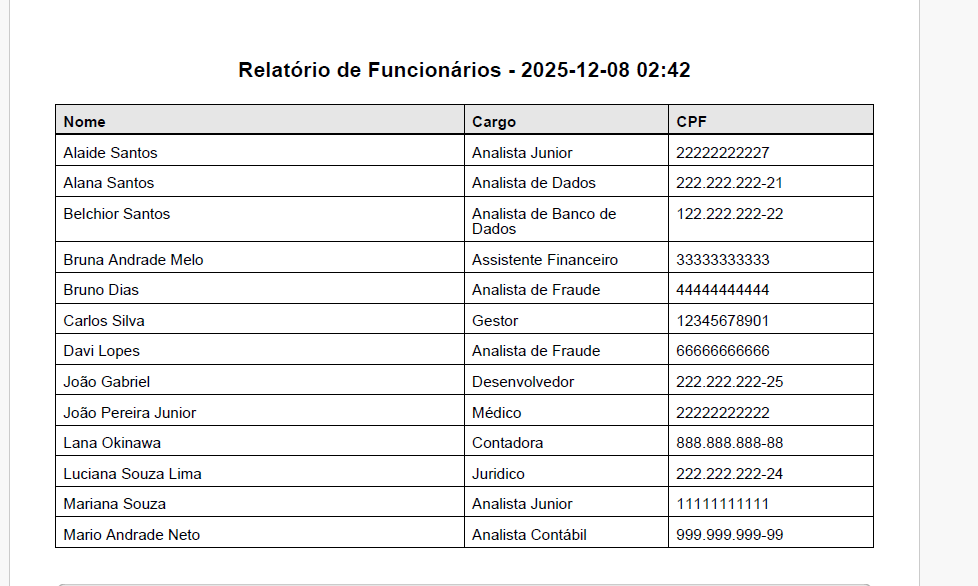
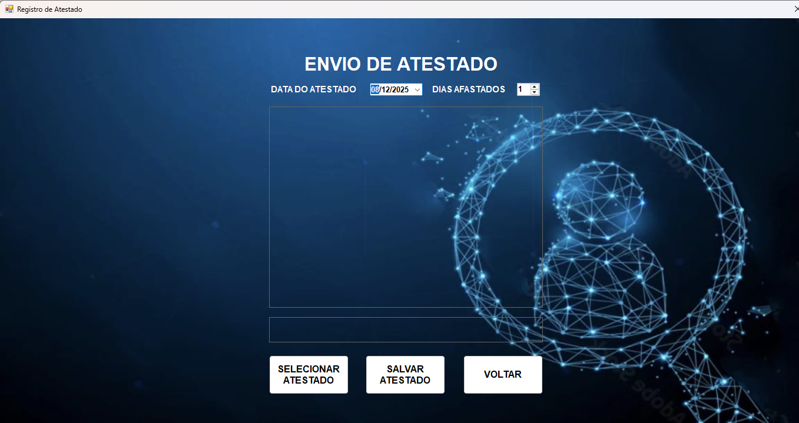

# 🕒 Ponto Eletrônico Escolar

Sistema de controle de ponto para funcionários, desenvolvido em **C#** com **Windows Forms**.

*Employee time-tracking system developed in C# with Windows Forms.*

---


## ⚙️ Funcionalidades | Features

* **🖥️ Interface amigável e intuitiva**
    * *Friendly and intuitive interface*
* **🆔 Controle por CPF e RE**
    * *Login using CPF and Employee ID*
* **🟢 Registro de entrada e saída**
    * *Clock-in and clock-out*
* **👨‍💼 Cadastro, edição e exclusão de funcionários**
    * *Employee management (add, edit, delete)*
* **📝 Registro de ponto e envio de atestado**
    * *Time record and medical certificate upload*
* **⏱️ Consulta de Ponto**
    * Permite a visualização do histórico de registros de ponto por parte dos Gestores.
    * *Time Point Query: Allows Managers to view the time record history.*
* **🧑‍⚕️ Menu do Médico e Periódicos**
    * Funcionalidade exclusiva para gestão de atestados e controle de exames periódicos dos funcionários.
    * *Doctor Menu and Periodicals: Exclusive functionality for managing medical certificates and controlling employee periodical exams.*


---

## 🔐 Logins de Teste | Test Logins

Use os seguintes dados para testar as diferentes permissões do sistema.

| Tipo | Nome | CPF | RE |
| :--- | :--- | :--- | :--- |
| **👨‍💼 Gestor (Admin)** | Carlos Silva Santos | `12345678901` | `001` |
| **👩‍💼 Funcionário** | Ana Souza Santos | `11111111111` | `002` |
| **🧑‍⚕️ Médico** | João Pereira Junior | `22222222222` | `003` |

---

## 🧰 Requisitos | Requirements

Para executar a aplicação, você precisará:

* **💻 Windows 10 ou superior**
    * *Windows 10 or later*
* **🧱 .NET Framework instalado**
    * *.NET Framework installed*
* **🛠️ Visual Studio (opcional)**
    * *Visual Studio (optional)*

---

## 🚀 Como Executar | How to Run

1.  **📥 Baixe o projeto**
    * Via Code > Download ZIP, ou:
    ```bash
    git clone [https://github.com/JeehSilphis/ProgramaMeuRH.git](https://github.com/JeehSilphis/ProgramaMeuRH.git)
    ```
    * *Download the project via Code > Download ZIP, or use the command above.*
2.  **📂 Extraia os arquivos** (se baixou via ZIP)
    * *Extract the files (if downloaded via ZIP).*
3.  **🧑‍💻 Abra o arquivo `.sln`** no Visual Studio.
    * *Open the `.sln` file in Visual Studio.*
4.  **▶️ Compile e execute** (`F5` ou `Ctrl + F5`).
    * *Build and run.*

---


## 🖼️ Imagens do Sistema | System Screenshots

### 🔐 Tela de Login / Login Screen

<br>

### 👩‍💼 Menu do Funcionário / Employee Menu

<br>

### 👨‍💼 Menu do Gestor / Manager Menu

<br>

### 🧑‍⚕️ Menu do Médico / Doctor Menu

<br>

### 🧑‍⚕️ Periódico / Periodical

<br>

### 📝 Cadastro de Funcionário / Employee Registration

<br>

### ✏️ Atualização de Funcionário / Employee Update

<br>

### ⏱️ Registro de Ponto / Time Record

<br>

### ⏱️ Consulta de Ponto / Point Query

<br>

### ⏱️ Lista de Funcionários / List of Employees

<br>

### 📄 Envio de Atestado / Medical Certificate Upload

<br>
    ---

## 📜 Licença | License

Este projeto é de uso acadêmico e está disponível para fins educacionais.

*This project is for academic use and available for educational purposes.*
